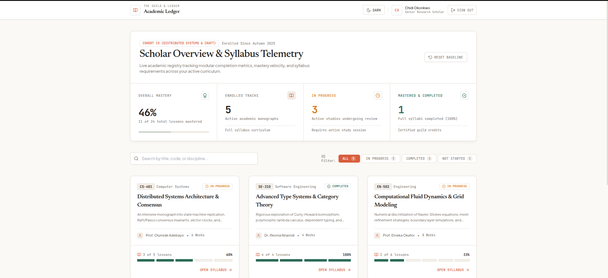
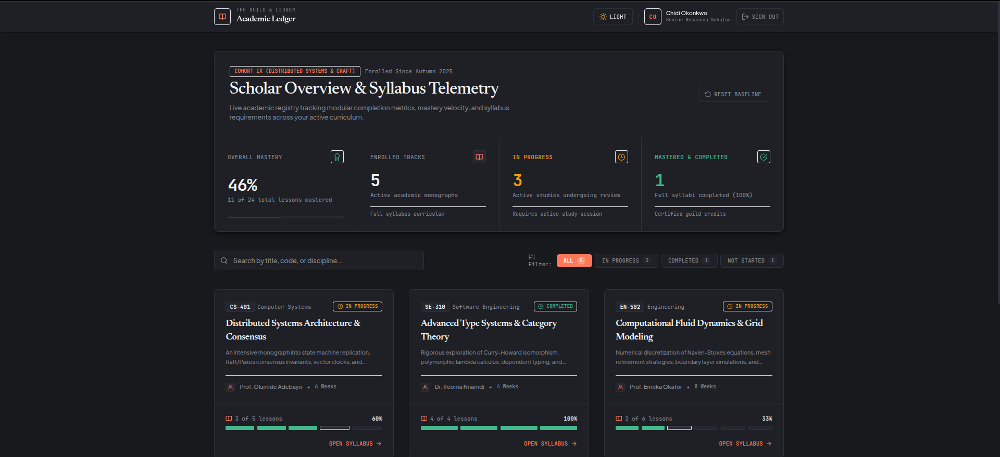

# Guild & Ledger — Student Course Dashboard

A responsive academic course and modular progress tracking dashboard built with React, Tailwind CSS, and React Router v6.

---

## Project Description

Guild & Ledger is an educational progress dashboard engineered for students and academic researchers tracking modular course progression across active curricula. The platform provides a structured, high-contrast interface modeled after scholarly field notebooks and guild ledgers, avoiding generic SaaS design patterns in favor of purposeful information hierarchy and tactile telemetry.

The application is architected around three core views:
1. **Login (`/login`)**: A client-validated access portal with field-level constraint checks, simulated asynchronous network authentication, and quick-access evaluation accounts.
2. **Dashboard (`/`)**: A central academic command center featuring a high-weight aggregate progress summary, real-time title/discipline search, count-synced status filtering, and an adaptive 1-to-3 column course grid.
3. **Course Details (`/course/:courseId`)**: An in-depth syllabus breakdown providing lesson descriptions, durations, direct completion toggles, and live progress re-computations.

This project is a frontend-only assessment build utilizing local state persistence (`localStorage`), custom Context API providers, and realistic mock dataset fixtures without a live database backend.

---

## Live Demo

[Live demo](your-deployment-url-here)

### Demo Login Credentials

The following credentials are hardcoded into `src/data/mockData.js` and verified by `src/pages/LoginPage.jsx`:

| Scholar Profile | Email Address | Access Code | Cohort / Scope |
| :--- | :--- | :--- | :--- |
| **Chidi Okonkwo (Primary)** | `chidi.okonkwo@guild.ac` | `demo123` | Senior Research Scholar • Cohort IX (Distributed Systems) |
| **Ngozi Adeyemi** | `ngozi.adeyemi@guild.ac` | `demo123` | Senior Fellow • Cohort VIII (Formal Logic) |
| **Babajide Adeleke** | `babajide.adeleke@guild.ac` | `demo123` | Junior Scholar • Cohort X (Spatial Ergonomics) |
| **Amina Bello** | `amina.bello@guild.ac` | `demo123` | Standard Scholar • Cohort General (Engineering) |

*Note: Interactive one-click demo filler buttons are provided directly on the login form.*

---

## Screenshots

<!-- Add screenshot image files to /docs/screenshots/ and link them below -->

### Dashboard (Light Mode)


### Dashboard (Dark Mode)


### Course Details & Interactive Syllabus


### Scholar Login Portal


---

## Features

### Core Requirements
- [x] Client-side validated login form with field-level required checks, email regex format validation, and minimum password length constraints
- [x] Simulated asynchronous authentication with realistic 750ms network delay and disabled loading state
- [x] Protected route wrapper (`ProtectedRoute`) intercepting unauthenticated traffic and preserving target redirect state
- [x] Live aggregated statistic summary calculating total courses, in-progress count, completed count, and overall curriculum mastery percentage
- [x] Reusable course card component displaying course code, category, title, description, instructor profile, duration, progress percentage, and status badge
- [x] Interactive lesson completion toggles on course details rows with immediate on-page calculation updates
- [x] Bidirectional state synchronization between Course Details and Dashboard views via shared context
- [x] Fully responsive multi-tier layout supporting mobile (375px), tablet (768px), and desktop (1280px+) form factors with minimum 48px touch targets
- [x] Graceful 404 handler for invalid or nonexistent course parameters with clear return navigation

### Bonus Features
- [x] Dual-mode Light and Dark theme system persisted to `localStorage` and synchronized with system preferences (`prefers-color-scheme`)
- [x] Real-time search filter querying course titles, catalog codes, and academic categories
- [x] Status filter tabs with real-time course count badges (`All`, `In Progress`, `Completed`, `Not Started`)
- [x] Bespoke handcrafted SVG architectural empty-state illustration for unmatched search queries
- [x] Animated mount transitions for progress bars and view transitions (`animate-fade-in`)
- [x] Monospace tabular figures (`tnum`) for metrics, percentages, and counters
- [x] Full accessibility compliance with explicit ARIA roles (`role="checkbox"`, `aria-checked`, `aria-invalid`, `aria-describedby`) and keyboard navigation support (`Space`/`Enter`)
- [x] System motion preference compliance via `@media (prefers-reduced-motion: reduce)`

---

## Tech Stack

| Technology | Version | Engineering Rationale |
| :--- | :--- | :--- |
| **React** | `^19.2.8` | Declarative component model and reactive rendering engine for dynamic UI updates. |
| **Vite** | `^8.2.2` | Fast development server with Hot Module Replacement and optimized production bundling. |
| **React Router** | `^6.30.6` | Client-side declarative routing, URL parameter extraction, and route guard redirects. |
| **Tailwind CSS** | `^3.4.19` | Utility-first styling framework extended with custom semantic tokens and CSS custom property mapping. |
| **react-icons** | `^5.7.0` | Feather icon set (`react-icons/fi`) providing consistent, vector-based iconography with zero emoji dependencies. |
| **Context API** | Built-in | Native React state management providing centralized auth, theme, and progress state without Redux overhead. |

---

## Project Structure

```
src/
├── components/          # Shared, reusable presentational UI elements
│   ├── CourseCard.jsx   # Curriculum monograph card with progress spine and metadata
│   ├── ProgressBar.jsx  # Segmented milestone spine notch bar and continuous progress track
│   └── StatusBadge.jsx  # Standardized semantic status badge component
├── contexts/            # Application state providers with localStorage persistence
│   ├── AuthContext.jsx  # User session, login, and logout state management
│   ├── ProgressContext.jsx # Lesson completion state, course progress, and status derivations
│   └── ThemeContext.jsx # Light and dark mode state manager syncing .dark class to root
├── data/                # Static mock fixtures and data computation helpers
│   └── mockData.js      # Scholar profiles, 5 comprehensive courses, and metric calculation utilities
├── pages/               # Top-level view components mounted to routes
│   ├── CourseDetailsPage.jsx # Full syllabus breakdown with interactive module completion
│   ├── DashboardPage.jsx     # Telemetry summary, search, filter tabs, and course grid
│   └── LoginPage.jsx         # Access portal with validation, loading state, and demo quick-fill
├── routes/              # Routing abstractions and route protection guards
│   └── ProtectedRoute.jsx   # Route guard redirecting unauthenticated users to /login
├── utils/               # Pure utility functions and formatters
│   └── formatters.js    # Initials extraction and data formatting helpers
├── App.jsx              # Application root configuring context providers and router tree
├── index.css            # Custom CSS variables, architectural shadow tokens, and scrollbar styles
└── main.jsx             # React entrypoint mounting application to DOM
```

---

## Setup Instructions

1. **Clone the repository**:
   ```bash
   git clone https://github.com/fluxaro/Student-dashboard-.git
   cd Student-dashboard-
   ```

2. **Install project dependencies**:
   ```bash
   npm install
   ```

3. **Start the local development server**:
   ```bash
   npm run dev
   ```

4. **Open your browser**:
   Navigate to `http://localhost:5173/` (or the port indicated in your terminal).

### Available npm Scripts
- `npm run dev`: Starts the Vite development server with Hot Module Replacement.
- `npm run build`: Compiles the TypeScript/JSX codebase into an optimized production bundle in `/dist`.
- `npm run lint`: Runs ESLint across all source files to verify code quality and style standards.
- `npm run preview`: Locally previews the production build output.

---

## Design Decisions

- **Aesthetic Direction ("The Guild & Ledger")**: Rather than defaulting to generic SaaS patterns (bright indigo buttons, rounded-2xl pills, gradient blobs), the interface uses a structured scholarly monograph aesthetic: warm alabaster paper tones (`#FBF9F5`) in light mode and obsidian basalt (`#111215`) in dark mode, paired with terracotta accents (`#D95D39`) and botanical spruce (`#266B56`).
- **Typographic Pairings**: Headings are set in `Newsreader` (optical serif) with tight letter-spacing for editorial authority, body text in `Plus Jakarta Sans` for geometric legibility, and all metrics/telemetry in `JetBrains Mono` with tabular numbers (`tnum`) so data reads with mathematical precision.
- **Architectural Layering over Heavy Shadows**: Replaced standard fuzzy drop-shadows with a disciplined 3-tier elevation scale (`shadow-ledger-sm`, `shadow-ledger-md`, `shadow-ledger-float`) combined with 1px hairline border strokes (`border-border-line`).
- **The Signature Motif ("The Ledger Milestone Spine")**: Course progress is visualized as an engraved, segmented chapter notch bar (`[▪][▪][▪][▫][▫]`) with discrete lesson pips rather than generic spinning progress rings.

---

## Challenges & How They Were Solved

### 1. Derived Status Computation vs. Stale State Synchronization
- **Problem**: Courses have both completion percentages and overarching statuses (`Not Started`, `In Progress`, `Completed`). Storing status strings as independent mutable state across multiple pages frequently leads to desynchronization bugs when lessons are toggled.
- **Solution**: The application treats status as a derived computation rather than raw state. `ProgressContext` maintains a normalized array of completed lesson IDs in `localStorage`. Helper function `computeCourseMetrics()` recalculates `completedLessons`, `totalLessons`, `progress` percentage, and `status` on the fly. When a user checks a lesson in `CourseDetailsPage`, the Dashboard's aggregate statistics and status filters immediately reflect the new values upon navigation without duplicate network or state dispatches.

### 2. Deep Link Preservation in Protected Routing
- **Problem**: When an unauthenticated user attempts to visit a deep URL (e.g. `/course/course-dist-sys`), standard auth redirects often drop the target parameter and navigate to `/` upon successful login, disrupting the user's flow.
- **Solution**: `ProtectedRoute` captures `useLocation()` and passes it to `Navigate` via `state={{ from: location }}`. Upon completing the simulated authentication handshake, `LoginPage` checks `location.state?.from?.pathname` and redirects the scholar directly to their intended course.

### 3. Dual-Mode Token Architecture Without Theme Flash
- **Problem**: Supporting custom design tokens in light and dark mode with Tailwind often causes class explosion or unreadable contrast if hardcoded hex values are used in component markup.
- **Solution**: Theme tokens were abstracted into CSS custom properties in `src/index.css` under `:root` and `.dark` blocks. `tailwind.config.js` was configured to map semantic color names (`canvas.bg`, `surface.card`, `ink.primary`, `brand.terracotta`, `progress.spruce`) directly to `var(--color-...)`. `ThemeContext` updates the `.dark` class on `document.documentElement` and stores preference in `localStorage`, resulting in instant, zero-flash transitions.

### 4. Responsive Grid & Touch Ergonomics Across Breakpoints
- **Problem**: Layouts that scale down directly from desktop often result in cramped lesson lists, truncated text, and sub-44px touch targets on mobile viewports (375px).
- **Solution**: The dashboard uses an adaptive CSS Grid configuration (`grid-cols-1 md:grid-cols-2 lg:grid-cols-3 gap-6 lg:gap-8`), while the stat summary shifts from a stacked single column to a 4-quadrant hairline-divided panel. Lesson rows enforce a minimum height of 68px with full-row click surfaces and explicit `role="checkbox"` bindings to ensure effortless mobile tapping.

---

## What I'd Do With More Time

- **Automated Test Suite**: Implement unit tests for metric computation functions (`computeCourseMetrics`, `getInitials`) using Vitest and integration tests for auth guards and lesson toggling using React Testing Library.
- **REST / GraphQL Backend Integration**: Replace the simulated 750ms timeout with real API integration (e.g. Node/Express or FastAPI with PostgreSQL), implementing JWT session management and HttpOnly cookies.
- **Syllabus Content Viewer & Note Taking**: Expand the Course Details page to include an active markdown lesson reader with persistent student annotations and bookmarking.
- **Optimistic Offline Sync**: Implement a Service Worker with IndexedDB cache to support offline lesson toggling that syncs upon reconnection.

---

## Author / Contact
- **GitHub**: [@fluxaro](https://github.com/fluxaro)
- **Repository**: [https://github.com/fluxaro/Student-dashboard-](https://github.com/fluxaro/Student-dashboard-)

